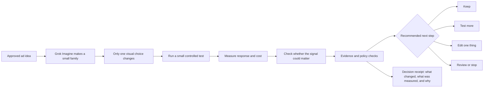

# ImagineSignal in plain language

| Field | Value |
|---|---|
| Version | 0.2 |
| Status | Current explanation; offline MVP implemented, production concept not launched |
| Author | Arun Sharma |
| Audience | Product, ads, sales, finance, design, safety, and general reviewers |

## The one-sentence version

ImagineSignal helps an advertiser learn which small change to an ad image is actually worth making again.

## The problem

Grok Imagine can create many attractive images quickly. That creates a new problem: a team can spend time and money making dozens of images without learning why one worked better than another.

If every image changes the colors, layout, background, product size, and message at once, a better result teaches us almost nothing. The next campaign starts from guesswork again.

## The idea

ImagineSignal starts with one approved image and creates a small family of alternatives. Each alternative changes only one named choice, such as the background, while the product, logo, offer, layout, and message stay fixed.

In the target product, the alternatives are tested with a small, approved audience. The implemented offline MVP exercises the same decision loop with clearly labeled synthetic totals. ImagineSignal then looks at three questions:

1. Did people respond differently?
2. Was the difference large and reliable enough to justify another step?
3. Could that difference matter when ads are close to one another in the selection process?

It then recommends a simple next action:

- Keep the original.
- Test one alternative further.
- Make one more controlled edit.
- Pause because there is not enough information.
- Send the decision to a person for review.
- Stop spending generation effort on this family.

The system does not publish an ad or change a campaign by itself in the first version.

## A simple analogy

Imagine a bakery testing a new package for the same cookie. It prints four packages that are identical except for the background color. It places them in a small test, measures which package people notice, checks whether the result is more than random luck, and prints more only after the evidence is strong enough.

ImagineSignal applies that discipline to images made with Grok Imagine. The current demo uses synthetic image fixtures, so it proves the workflow rather than live provider quality or audience response.

## Why the small signal matters

An ad is often competing with other ads whose scores are close. A small improvement may not matter when the ad is far behind, and it may be unnecessary when the ad is already far ahead. It matters most near a decision boundary, where a modest change can alter which ad is selected.

The auction research supplied with this project gives us a careful way to explore that possibility in a simulation. It does not prove that a creative change will increase real revenue. A real claim requires an authorized experiment with real outcomes.

## Broad-audience system diagram

## What each group gains

| Group | Practical value |
|---|---|
| Advertisers | Fewer random variations and a clearer reason for the next creative choice |
| Grok Imagine | More purposeful repeat usage, with lower waste per useful result |
| X Ads | Better organized creative tests and a path to validated response signals |
| Ads science | Clean one-change experiments instead of tangled creative comparisons |
| Finance | Generation cost tied to approved creatives and measured outcomes |
| Sales and customer success | A clear explanation and receipt for every recommendation |
| Safety, policy, and legal | Existing controls stay in force, with lineage and human review added |
| Infrastructure | Budget caps, duplicate suppression, and fewer unnecessary high-cost generations |

## What makes it more than an image generator

An image generator answers: "What can we make?"

ImagineSignal answers: "What did we change, what did we learn, and what is the least wasteful next step?"

## What it does not promise

ImagineSignal does not promise that every prettier image gets more clicks, that every click creates more revenue, or that a simulation predicts the real auction. It also does not replace existing ad policy, content moderation, brand review, or experiment approval.

The first honest value proposition is improved creative-learning efficiency: more useful evidence for each image-generation dollar. Revenue is a later experimental outcome, not an opening claim.

## Two-minute talk track

"Grok Imagine makes it easy to create many ad images, but volume alone does not tell an advertiser what works. ImagineSignal turns image creation into a controlled learning loop. It starts with one approved image and changes one visible choice at a time. It records the family relationship, cost, and exact change, runs a small approved comparison, and recommends whether to keep, test, edit, review, or stop. A research layer also checks whether a small measured response difference could matter when ads are closely matched. Every conclusion carries a receipt that says whether it came from a proposal, replay, simulation, shadow estimate, or real experiment. The first version cannot publish, spend, or change ranking. Its immediate value is simple: learn more while generating less waste."

## Questions a broader audience may ask

### Is this just A/B testing?

It includes controlled testing, but adds the missing steps before and after it: disciplined image creation, parent-child history, generation cost, a clear next action, and a receipt showing why that action is allowed.

### Why not generate a hundred images and choose the best?

That can select a lucky winner and waste generation budget. It also hides which change helped. A small, structured family produces a cleaner lesson that can be reused.

### Does a SuperGrok subscription help?

Yes for hands-on exploration in the Grok app, prompt refinement, and manual Imagine trials. For code, the project still needs an API key with confirmed Imagine model access and billing in the xAI Console. The current official documentation is not clear enough to treat a consumer subscription alone as a production API entitlement. The implementation therefore begins offline and checks account access before any paid call.

### Where is trust and safety?

It remains a required gate around the workflow. It is not the central novelty. Provider moderation, existing ads-policy enforcement, brand constraints, lineage checks, and human approval all stay active.

### When can we say it increases revenue?

Only after an authorized randomized test measures the exact approved business outcome for the tested traffic slice, while also checking advertiser value and user experience. Ordinary X Ads analytics support advertiser spend and, when configured, attributed purchase value. A claim about X revenue requires separately authorized internal evidence. A simulation can motivate that test, but cannot replace it.
