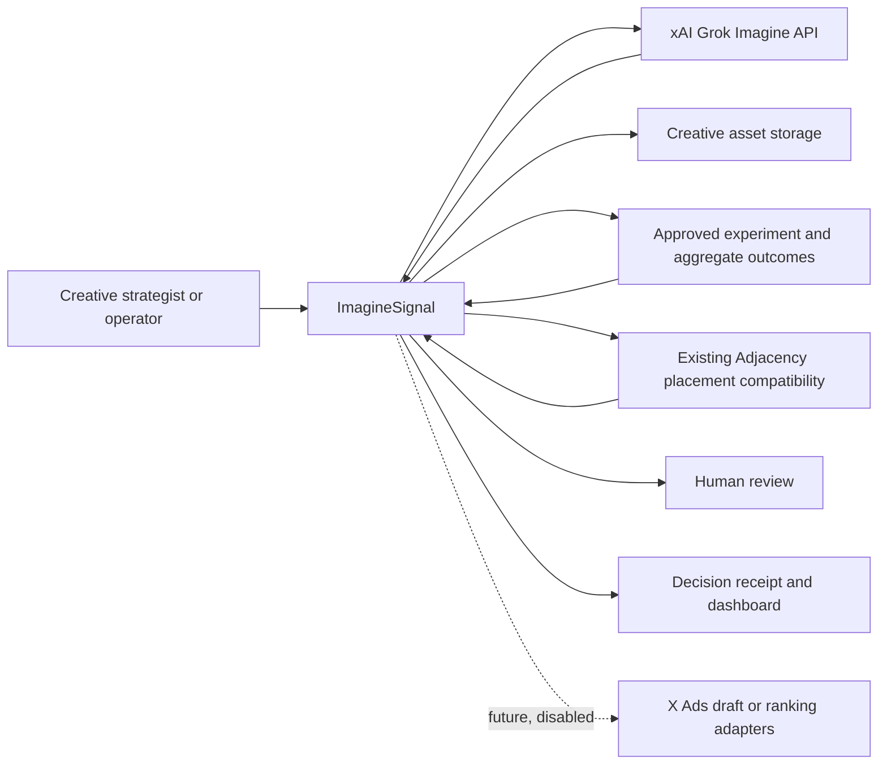
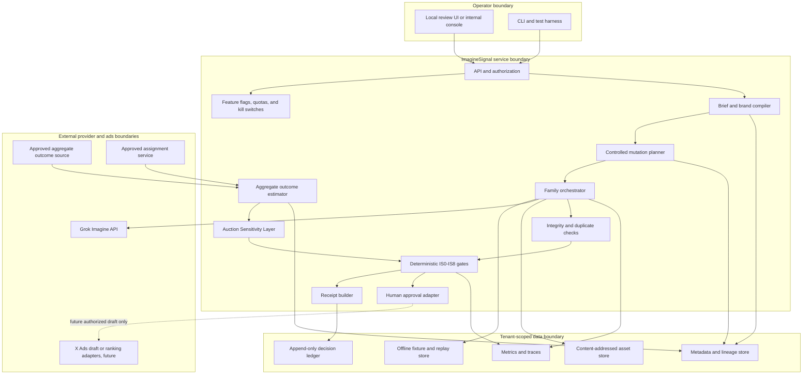
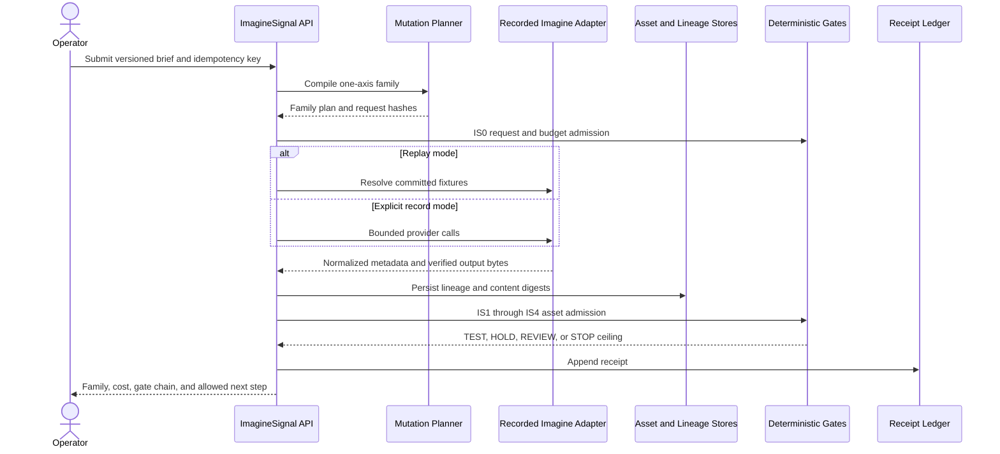
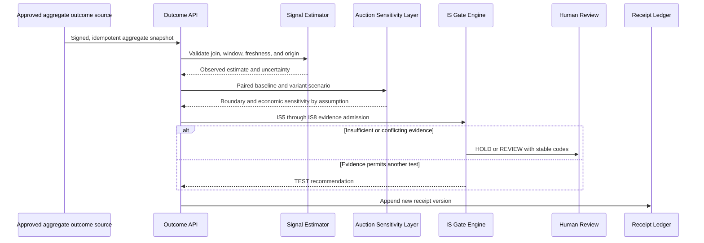
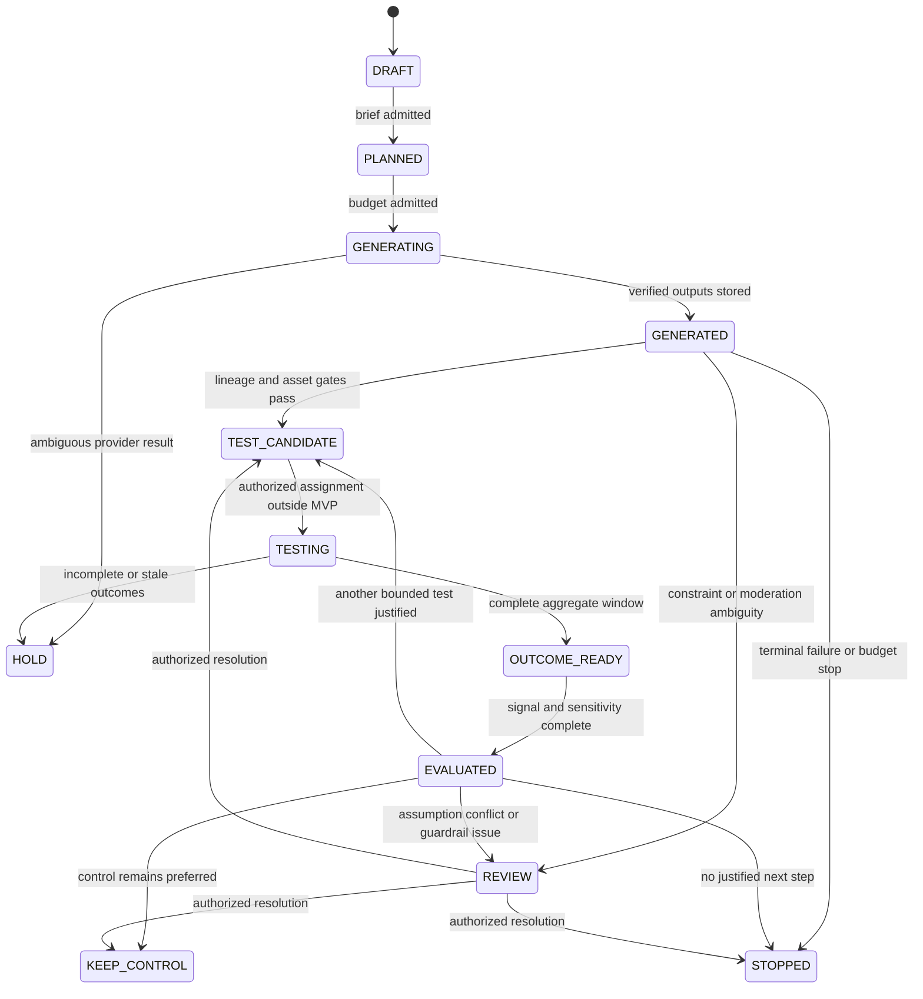

# ImagineSignal system design

| Field | Value |
|---|---|
| Version | 0.1 |
| Status | Proposed |
| Author | Arun Sharma |
| Reviewers | Product, Imagine API, Ads engineering, data, experimentation, security, privacy, SRE |
| Last reviewed | 2026-08-05 |
| Re-review trigger | Any production-data access, write path, ranking influence, or provider-contract change |

## 1. Design goals

1. Generate small creative families where one declared attribute changes at a time.
2. Preserve a complete, immutable line from campaign brief to output, outcome, simulation, decision, and human override.
3. Reduce wasted generation through duplicate checks, evidence-aware stopping, and staged quality upgrades.
4. Separate observed response, predicted response, simulated economics, and causal production evidence.
5. Make every next action deterministic after the proposal and evidence stages.
6. Reuse the existing repository's contract, gate, replay, and review patterns without changing brand-safety semantics.
7. Keep every production write, spend change, and ranking change outside the MVP boundary.

## 2. Context diagram

The X Ads connection is a future boundary. It is present in the diagram so reviewers can inspect the eventual trust boundary, but its write path is absent from the MVP implementation.

## 3. Container design

## 4. Component responsibilities

| Component | Owns | Must not own |
|---|---|---|
| API and authorization | Tenant identity, idempotency, schema version, request tracing | Creative judgment or auction logic |
| Brief and brand compiler | Structured objective, contexts, mutable axis, locked constraints | Provider calls or ad publishing |
| Mutation planner | Parent, axis, levels, prompt fragments, expected family size | Outcome selection after seeing results |
| Family orchestrator | Budgeted generation or replay, retries, state transitions | Final recommendation |
| Imagine adapter | Provider request mapping, response normalization, cost and moderation metadata | Business gates or credential storage |
| Asset store | Verified bytes, digest, media metadata, retention state | Provider URLs as durable identity |
| Integrity and duplicate checks | Hash integrity, parent existence, exact duplicate and replaceable near-duplicate checks | Aesthetic ranking |
| Outcome estimator | Aggregate counts, uncertainty, attribution window, data freshness | Raw user-level optimization or auction claims |
| Auction Sensitivity Layer | Scenario-specific score and economics simulation | Live bidding, floors, reserves, or production claims |
| Gate engine | Evidence-to-action ceiling and stable reason codes | Network, clock, or free-form model decisions |
| Approval adapter | Authorized human action and reason | Silent promotion or policy bypass |
| Receipt builder | Complete immutable explanation and evidence references | Mutating source evidence |
| Flags, quotas, and kill switches | Tenant, campaign, action, model, and environment controls | Hiding a failed gate |

## 5. Core synchronous flow

This flow does not publish or assign traffic.

## 6. Outcome and sensitivity flow

Only an authorized later experiment can lift the action ceiling beyond `TEST`.

## 7. Trust boundaries

### Advertiser tenant boundary

Every brief, asset, outcome, scenario, and receipt carries `tenant_id`. Parent-child links and joins must match the tenant. Cross-tenant reads, writes, or learned private outcomes are release blockers.

### xAI provider boundary

The adapter sends only the approved prompt and media. Credentials are injected at the transport and never enter hashes, fixtures, logs, or receipts. Responses remain untrusted until the schema, moderation status, bytes, digest, and cost fields are validated.

### Asset URL boundary

Public or signed URLs are not fetched without scheme, host, redirect, size, content-type, and timeout controls. The preferred prototype path is base64 output decoded locally or a private provider `file_id`. A temporary URL is never treated as durable storage.

### Outcome boundary

The planned optimizer consumes aggregate snapshots, not raw user events. Each snapshot identifies its source, experiment arm, campaign, creative, context, attribution method, window, freshness, and digest.

### Auction-log boundary

Candidate bids, competitor scores, prices, and billed revenue are highly restricted. They are absent from the public prototype. Any later access needs a separate owner, purpose limitation, access domain, retention decision, and audit.

### Human approval and production-write boundary

No model output or simulation reaches a write adapter directly. An approved gate result, current campaign version, feature flag, authorization state, and idempotency key must converge at a separate enforcement point. That point is not implemented in the MVP.

### Offline evaluation boundary

Replay mode has no production credentials and no production-write client. The process must be incapable of switching to live because of a missing fixture or provider error.

## 8. Data stores

| Store | Data | Consistency | Retention |
|---|---|---|---|
| Metadata and lineage | Versioned briefs, mutations, assets, outcomes, scenarios, approvals | Transactional for parent and child writes | Policy TBD before live data |
| Content-addressed blobs | Source and generated media keyed by SHA-256 | Write once, digest verified | Policy TBD; synthetic fixtures may be committed |
| Decision ledger | Append-only receipts and overrides | Immutable append; every terminal decision required | Longer than mutable state, policy TBD |
| Fixture store | Canonical request, normalized response metadata, asset digest | Content-addressed and secret scanned | Committed only for non-sensitive assets |
| Metrics and traces | Operational counters and structured traces | At-least-once with deduplication | Classification-specific, no raw secrets or events |

For the local prototype, files can implement these interfaces. A production deployment may use a relational metadata store, object storage, an append-only audit stream, and a metrics platform. The contracts must remain storage-independent.

## 9. State machine

`PROMOTED` is intentionally absent from the MVP state machine.

## 10. Deployment modes

| Mode | Network | Data | Allowed actions | Maximum evidence class |
|---|---|---|---|---|
| `fixture` | None | Synthetic and committed replay | Generate by replay, evaluate, explain | `FROZEN_REPLAY` or `SIMULATED` |
| `record` | xAI Imagine only | Non-sensitive demo data | Record bounded outputs, then replay | `IMPLEMENTED` until benchmarked |
| `shadow` | Approved read paths only | Aggregate permitted-use outcomes | Recommend and log, no writes | `SHADOW_ESTIMATE` |
| `draft_beta` | Approved draft adapter | Tenant data with human approval | Create draft only | Evidence-specific |
| `experiment_display_only` | Authorized experiment | Live aggregate outcomes | Randomize creative after allocation | `RANDOMIZED_DISPLAY_ONLY` |
| `experiment_signal_aware` | Authorized ranking experiment | Restricted auction and outcome data | Bounded signal test with kill switch | `RANDOMIZED_END_TO_END` |

Mode is explicit configuration, not inferred from credentials. A lower mode cannot call a higher-mode adapter.

## 11. Failure behavior

| Failure | Response | Retry | Decision ceiling |
|---|---|---|---|
| Missing fixture | Fail with fixture-miss code | Never switch live | `HOLD` |
| Provider 429 | Respect backoff within request and dollar budgets | Bounded | `HOLD` after exhaustion |
| Provider 5xx or timeout | Reconcile idempotency before any paid retry | Bounded | `HOLD` |
| Provider moderation failure | Terminal rejection for output | No bypass retry | `STOP` or `REVIEW` by policy |
| Malformed response | Reject response and retain trace | No uncontrolled retry | `HOLD` |
| Asset digest mismatch | Quarantine bytes | No admission | `STOP` |
| Missing parent or tenant mismatch | Reject contract | None | `STOP` and security alert for tenant mismatch |
| Duplicate | Record duplicate relationship | No quality upgrade | `KEEP` or `STOP` |
| Outcome join failure | Quarantine snapshot | Retry after source correction | `HOLD` |
| Stale outcomes | Display freshness | Wait for complete window | `HOLD` |
| Simulation non-convergence | Mark invalid | May rerun only with predeclared settings | `REVIEW` |
| Learner or mechanism sign disagreement | Show all results | No cherry-picking | `REVIEW` |
| Ledger write failure | Treat decision as uncommitted | Retry ledger only | No outward action |
| Approval service unavailable | Retain draft | Bounded | No write |

## 12. Scaling and efficiency

- Batch same-prompt variations only when they represent the same declared mutation level. Different controlled prompts use bounded concurrency so each request retains its own lineage.
- Screen exact duplicates and inexpensive integrity checks before quality upgrades or tests.
- Use the standard Imagine model for broad exploration and the quality model only for admitted finalists, subject to product evaluation.
- Reuse private file IDs for iterative edits when retention and cost policy permit it.
- Store provider-reported request cost, not only a static price estimate.
- Apply per-tenant, campaign, family, day, call, image, quality-tier, and dollar caps.
- Use backpressure to stop new generation when asset persistence, ledger, or outcome queues are unhealthy.

## 13. Production extensions that require new ADRs

- Event sourcing versus mutable workflow state.
- Production object-store retention, residency, and tenant encryption keys.
- Online versus batch recommendation.
- Outcome attribution and experiment-assignment unit.
- Model fallback and alias-upgrade policy.
- Multi-region failover and consistency.
- Human-approval enforcement and any X Ads draft adapter.
- Ranking-signal export, if ever proposed.

